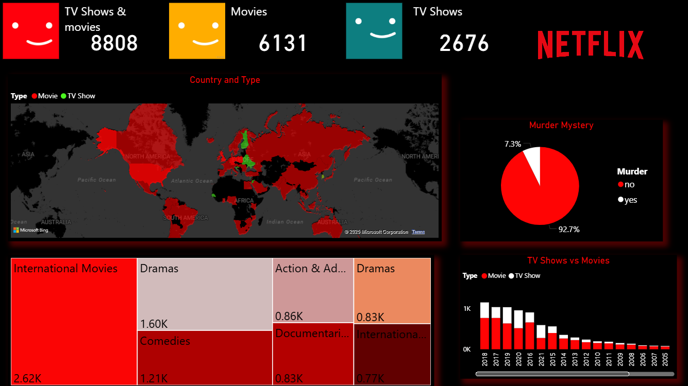

# 🎬 Netflix Dashboard (Power BI)

## 📘 Overview
The **Netflix Dashboard** is an interactive data visualization project developed using **Power BI**.  
It provides an analytical overview of Netflix’s content library — exploring trends in movies and TV shows, release patterns, genre distribution, ratings, and regional insights.  

This project demonstrates skills in **data cleaning, visualization, and storytelling** using real-world streaming data.

---

## 🧠 Objective
- To analyze the **Netflix dataset** and uncover insights into its content catalog.  
- To visualize global content trends across genres, countries, and years.  
- To identify key patterns in movie vs. TV show distribution, ratings, and durations.  
- To design an engaging dashboard highlighting **Netflix’s content strategy and evolution** over time.

---

## 🗂️ Dataset
- **Source:** [Kaggle – Netflix Movies and TV Shows Dataset](https://www.kaggle.com/shivamb/netflix-shows)  
- **Format:** CSV  
- **Attributes include:**
  - `Show ID`
  - `Title`
  - `Director`
  - `Cast`
  - `Country`
  - `Date Added`
  - `Release Year`
  - `Rating`
  - `Duration`
  - `Genre / Listed In`
  - `Type` (Movie / TV Show)
  - `Description`

---

## ⚙️ Tools & Technologies
- **Power BI Desktop** – for data modeling and interactive visuals  
- **Microsoft Excel** – for data cleaning and pre-processing  
- **Kaggle Dataset** – Netflix Movies and TV Shows dataset  

---

## 📊 Key Features & Visuals
- 🎞️ **Content Type Analysis:** Breakdown of Movies vs. TV Shows.  
- 📅 **Year-wise Release Trend:** Visual timeline showing Netflix content growth.  
- 🌍 **Country-wise Content Distribution:** Geographical insights into where Netflix content is produced.  
- 🎭 **Genre Popularity:** Visualization of top genres on Netflix.  
- ⭐ **Rating Distribution:** Analysis of content based on maturity and audience category (TV-MA, PG, etc.).  
- ⏱️ **Duration Insights:** Comparison of movie durations and TV show seasons.  
- 🔍 **Interactive Filters:** Filter content by year, country, genre, or type.

---

## 🧩 Dashboard Insights
- **Movies** dominate the platform’s content library, but **TV Shows** have increased in recent years.  
- The **United States and India** contribute a significant portion of Netflix’s catalog.  
- **Drama and Comedy** emerge as the most common genres globally.  
- **TV-MA** (Mature Audience) is the most frequent rating, showing a focus on adult audiences.  
- Netflix’s content expansion accelerated significantly after **2015**, reflecting global streaming growth.

---

## 🚀 How to Use
1. Clone or download this repository.  
2. Open the `.pbit` file in **Power BI Desktop**.  
3. Load the Netflix dataset (CSV from Kaggle).  
4. Refresh the data model to view the updated visuals.  

---

## 🧰 Skills Demonstrated
- Data cleaning and transformation  
- DAX measures and calculated columns  
- Power BI dashboard design  
- Interactive storytelling through data  
- Real-world business data analysis  

---

## 📸 Dashboard Preview

*(The above image is an actual screenshot from the Power BI dashboard.)*

---

## 📚 Future Improvements
- Integrate **real-time Netflix API data** for automated updates.  
- Add **trend forecasting visuals** using Power BI predictive analytics.  
- Create a **web-embedded interactive version** for online access.

---

## 👨‍💻 Author
**Sai Kumar Reddy N**  
📧 Email: [saimanikya8152@gmail.com.com]  
💼 [LinkedIn Profile](https://linkedin.com/in/thesaireddy20)  
💻 [GitHub Profile](https://github.com/thesaireddy20)

---

## 🏷️ Tags
`#PowerBI` `#DataAnalytics` `#Netflix` `#Dashboard` `#DataVisualization` `#Kaggle` `#SaiKumarReddyN`
